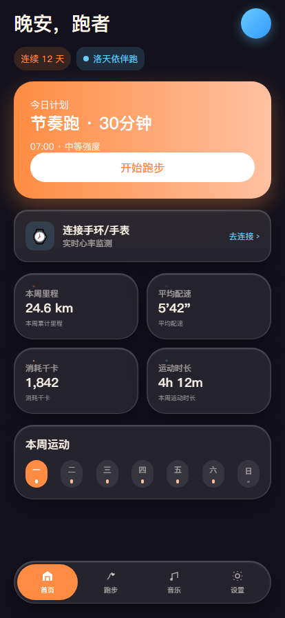
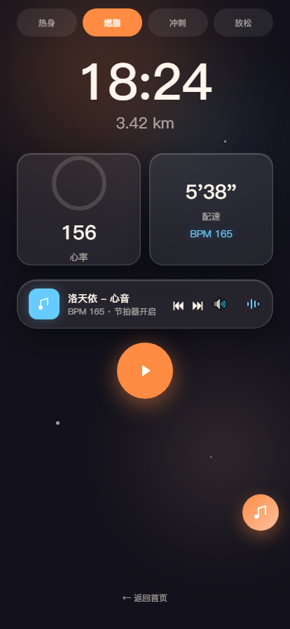
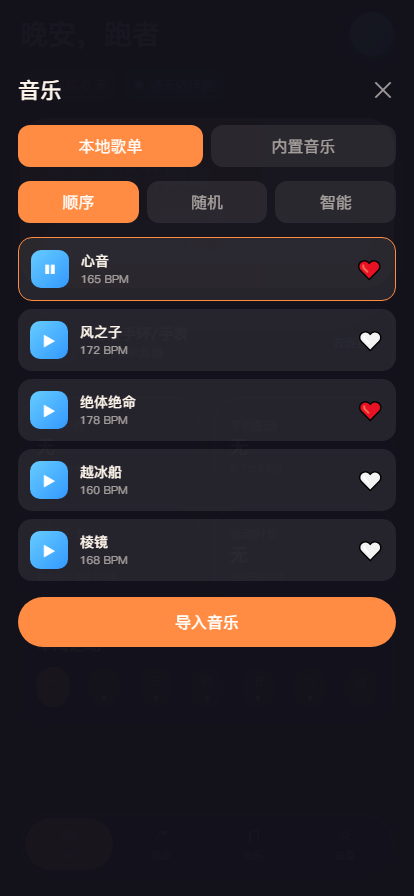
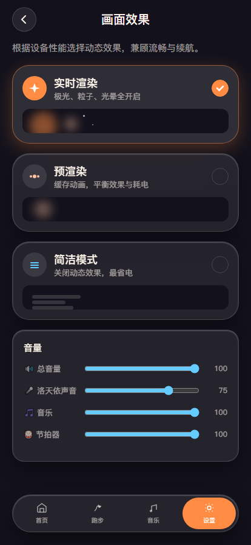

# 洛天依陪跑 · RUN

> 洛天依语音陪跑应用 —— 节拍器 + 语音引导 + 音乐播放，让跑步不再孤单
>
> **作者**：Cory ｜ **哔哩哔哩**：本人内心十分开朗


## ✨ 功能特性

### 🏃‍♂️ 智能训练
- **四阶段训练**：热身 → 燃脂 → 冲刺 → 放松，科学配速
- **节拍器**：60–200 BPM 可调，精准控制跑步节奏
- **计时追踪**：实时显示训练时长、里程、配速、消耗

### 🎤 洛天依语音引导
- **16 句定制语音**：阶段提示 + 控制语音 + 8 句随机鼓励语
- **本地音频优先**：预生成的洛天依语音文件，音质更佳
- **TTS 自动回退**：缺少语音文件时自动使用系统 TTS
- **字幕显示**：语音播报时同步显示文字

### 🎵 音乐播放器
- **本地音乐导入**：支持导入本地音乐文件
- **歌单管理**：顺序 / 随机 / 智能三种播放模式
- **BPM 同步**：音乐 BPM 与训练节奏自动匹配
- **智能推荐**：根据当前阶段 BPM 推荐合适的歌曲

### 🎨 精美界面
- **暗色主题**：深夜跑步也不刺眼
- **心率环动画**：直观展示运动状态
- **节拍可视化**：节拍点动画反馈
- **移动端适配**：专为手机屏幕设计，支持性能分级

> ⚠️ **穿戴设备连接说明**：蓝牙心率设备连接功能当前**暂不可用（已搁置）**，心率相关代码保留在 `core/engine.js` 中，待后续完善后再开放。

## 📸 界面预览

| 首页 | 跑步页 |
|------|--------|
|  |  |

| 音乐歌单 | 设置页 |
|----------|--------|
|  |  |

更多截图见 [`screenshots/`](screenshots/) 目录。

## 🚀 快速开始

### 环境要求
- 现代浏览器（Chrome / Edge / 安卓 Chrome 推荐）
- **必须通过 HTTP 服务访问**（不能直接 `file://` 打开）

### 本地运行

```bash
# 进入项目目录
cd 洛天依陪跑-开源版

# 启动本地服务器（任选其一）
python -m http.server 8000        # Python 3
npx serve .                      # Node.js
php -S localhost:8000            # PHP
```

然后在浏览器中打开 `http://localhost:8000`

### 使用步骤

1. **（可选）导入音乐**：切换到音乐页面，导入本地音乐文件
2. **开始训练**：点击「开始训练」，跟随洛天依的引导开始跑步

## 📁 项目结构

```
├── index.html              # 主页面（完整整合版）
├── core/
│   └── engine.js           # 核心引擎（纯逻辑层，事件驱动）
├── voices/                 # 洛天依语音文件（16 句）
│   ├── zhunbei.wav         #   开场白
│   ├── reshen.wav          #   热身
│   ├── ranzhi.wav          #   燃脂
│   ├── chongci.wav         #   冲刺
│   ├── fangsong.wav        #   放松
│   ├── jieshu.wav          #   结束语
│   ├── zanting.wav         #   暂停
│   ├── kaishi.wav          #   继续
│   └── jiayou.wav 等 8 句  #   随机鼓励语
├── docs/
│   ├── API.md              # 引擎 API 文档
│   └── voice_script.md     # 语音脚本说明
├── screenshots/            # 界面截图（10 张）
├── assets/                 # 应用图标 + 宣传海报
├── legacy/                 # 早期原型（index.html + app.js + style.css，仅供参考）
├── README.md               # 项目说明
├── LICENSE                 # MIT 许可证
├── .gitignore              # Git 忽略规则
├── UPLOAD.md               # 上传 GitHub 指南
└── upload-to-github.ps1    # 一键上传脚本
```

## 🔧 技术架构

### 核心引擎（`core/engine.js`）
纯逻辑层，不依赖 DOM，提供：
- 节拍器（Web Audio 精确调度）
- 音乐播放管理
- 语音播报队列
- 训练流程状态机
- 心率采集（预留，当前搁置）

### UI 层（`index.html`）
订阅引擎事件，负责渲染：
- 心率环动画
- 阶段进度条
- 节拍可视化
- 语音字幕

### 事件驱动架构

```
UI 层 ←事件订阅— 核心引擎 —API 调用→ UI 层
     (state / stage / bpm / beat / voice / heartrate / tick)
```

## 📚 文档

- 引擎 API 文档：[docs/API.md](docs/API.md)
- 语音脚本说明：[docs/voice_script.md](docs/voice_script.md)

## 🎵 语音生成

洛天依语音可以通过以下方式生成：

1. **GPT-SoVITS**（推荐）：使用社区 LuoTianyi 模型本地合成
2. **ACE Studio**：官方洛天依 AI 音色
3. **VOCALOID**：使用洛天依声库调整参数

生成后将文件按 `docs/voice_script.md` 中的命名规范放入 `voices/` 目录即可。本仓库已附带 16 句现成语音。

## 🎶 关于内置音乐

内置音乐（四重奏专辑）因**版权原因未包含在仓库中**。如需使用，请：

1. 自行准备洛天依音乐 mp3 文件
2. 放入 `assets/music/四重奏/` 目录
3. 创建 `assets/music_meta.json` 元数据文件（格式见 `docs/API.md`）

本地导入的音乐文件不依赖此目录。

## 🔓 开源声明

本项目 **100% 开源**，采用 [MIT License](LICENSE) 协议，你可以自由地：

- ✅ 商用 — 用于商业产品/服务
- ✅ 修改 — 二次开发、定制化
- ✅ 分发 — 自由传播、分享
- ✅ 私有使用 — 个人/团队内部使用

唯一要求：保留版权声明和许可证文本。

### 非开源内容（保护隐私）

以下内容**不**包含在本仓库中，属于个人隐私，严格保护：

| 类别 | 说明 |
|------|------|
| 个人跑步记录 | 运动数据、心率历史、跑步轨迹等 |
| 个人账号信息 | 头像、昵称、邮箱、手机号等 |
| 个人音乐库 | 用户自行导入的本地音乐文件 |
| 密钥/凭证 | API Key、Token、私钥等敏感信息 |
| 私人照片 | 个人截图、生活照片等 |

> 💡 **你的数据你做主**。本应用所有数据默认存储在你的设备本地，不上传任何服务器。

## 🔒 隐私保护

- **本地优先**：所有功能基于浏览器本地运行，不需要注册账号
- **数据不泄露**：运动数据、跑步记录仅存储在你的设备上
- **无追踪**：无埋点、无统计、无广告、无第三方追踪
- **开源可审计**：代码完全公开，任何人都可以审查安全性

## ⚠️ 注意事项

- **音频自动播放**：首次播放需要用户交互（点击「开始训练」即可满足）
- **iOS 限制**：iOS Safari 不支持 Web Bluetooth
- **穿戴设备**：蓝牙心率连接暂不可用，训练会自动按时间推进阶段

## 📱 安卓版本

APK 安装包通过 GitHub Releases 分发，不在仓库内（避免仓库过大）。

## 🤝 贡献

欢迎提交 Issue 和 Pull Request！一起让天依陪更多人跑步～

## 📄 许可证

[MIT License](LICENSE) © 2026 Cory（哔哩哔哩：本人内心十分开朗）

---

💙 *天依陪你跑，每一步都不孤单 —— 开源、免费、无广告、保护隐私*
